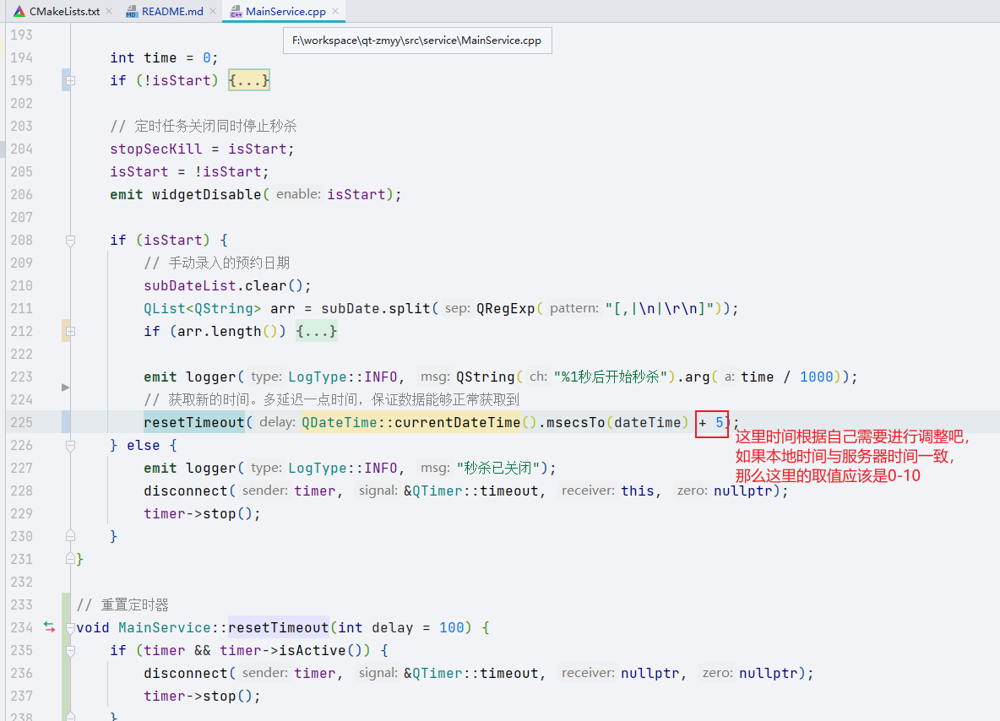

# 知苗易约

>  [Api](./doc/Api.md)

> 仅供交流使用，切勿用于商业用途

> `c/c++`小白，现学现卖，不喜勿喷。链路已通
> 
> 我是在有次临时放苗是抢到的。正常抢人太多，预估定时器时间需要进行微调
> 
> 

## 未解决问题
1. 新的解密工具会产生`\b`、`\f`字符在json末尾，已处理但可能会遇到其它的字符导致json解析失败
2. 目前流程能通过已开放的疫苗，暂未开放的疫苗需要抓包测试

## 目录说明
```text
| --- doc 文档
| --- src 源码
      | --- lib 库
      | --- model 请求/响应json转换对象
      | --- service ui逻辑代码
      | --- ui 界面构建代码
      | --- util 工具
      | area.json 地区代码
      | AreaBox 地区选择
      | Config 全局定义宏
```

## 界面使用说明
> 

## 加密源码

1. 对明文Hex并AES加密，填充方式为PKCS7
2. signature取前16为作为key
3. iv固定为：1234567890000000

```js
function h(e) {
    return new Promise(function (t, s) {
        var a = r.enc.Utf8.parse(o.substring(0, 16)),
            n = r.AES.encrypt(e, a, {
                iv: u,
                mode: r.mode.CBC,
                padding: r.pad.Pkcs7
            });
        console.log(o.substring(0, 16)), // 这里输出key
            t(n.ciphertext.toString());
    });
}
```

## 解密源码

1. 对密文Hex并AES解密，填充方式为PKCS7
2. signature取前16为作为key
3. iv固定为：1234567890000000

```js
var t = (
    a = e.data,
        i = r.enc.Utf8.parse(o.substring(0, 16)),
        c = r.enc.Hex.parse(a),
        d = r.enc.Base64.stringify(c),
        r.AES.decrypt(
            d,
            i,
            {
                iv: u,
                mode: r.mode.CBC,
                padding: r.pad.Pkcs7
            }).toString(r.enc.Utf8)
);
t && (e.data = JSON.parse(t));
```

## 抓包简易教程
> 抓包最好不要开代理，会导致端口经常变化

1. 下载安装charles
2. 安装证书 
> 
3. 设置
> 
4. 抓包
> 

## signature获取方法

> 从别的大佬处了解可以通过cookie取得。目前采用的改方法，比下面的更方便

> ~~使用`cheat engine`附加小程序进程并按下图操作找到signature~~
>
> 
>
> 
>
> 

## cookie获取

- 抓包获取
- cookie过期时间大概50分钟

## WeChatWin.dll偏移（DLL注入）
> 最开始想通过DLL进程注入来自动获取小程序的签名等信息，无奈技术不够，注入失败，不清楚是不是有什么保护导致注入不了

- 用户信息dll偏移地址

```text
WeChatWin.dll dll基址
WeChatWin.dll+1EA52AC 昵称
WeChatWin.dll+1EA5428 微信号
WeChatWin.dll+1EA52E0 手机号
WeChatWin.dll+1EA5740 设备
WeChatWin.dll+1EA558C 头像
WeChatWin.dll+1EA5708 微信id
```
cookie可以多个程序使用，电脑配置高、带宽高的话，成功率高（限制了并发频率，不清楚是依据规则IP还是用户）

## windows环境打包事项
> 打包后需要拷贝dll至打包后的目录下

```bash
    # 位于`${path}/minGW/bin`目录下
    libgcc_s_seh-1.dll
    libstdc++-6.dll
    libwinpthread-1.dll
```